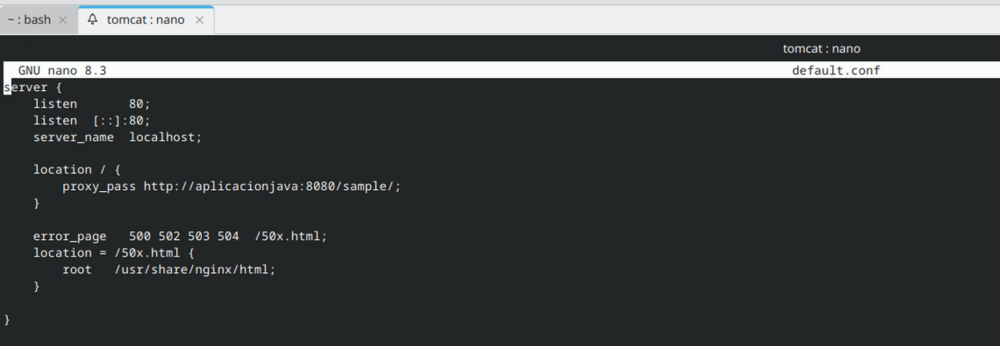
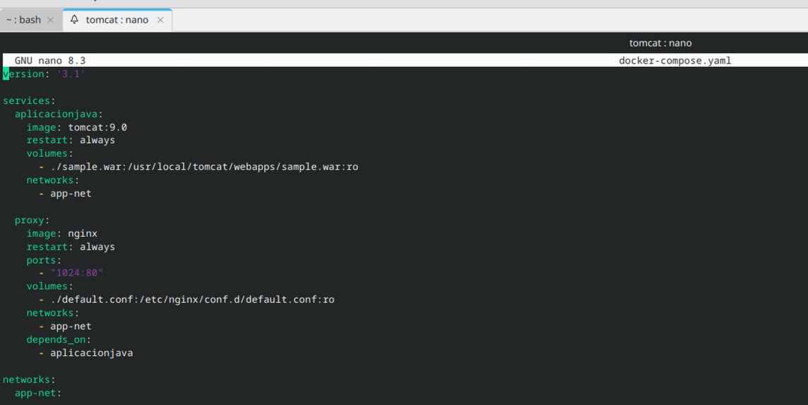
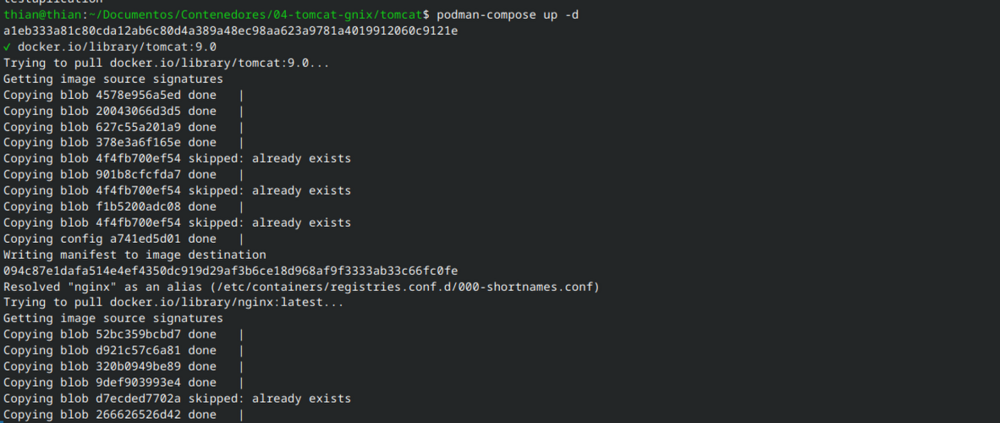
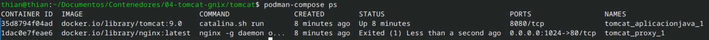
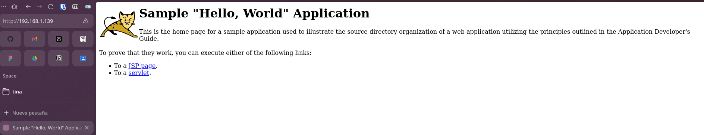
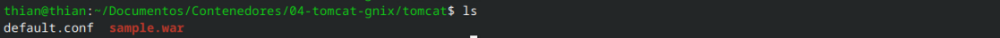
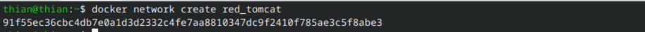
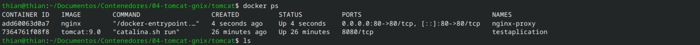

# Despliegue de Aplicación Java (Tomcat) con Nginx como Proxy Inverso

Este proyecto demuestra cómo desplegar una aplicación web Java (`.war`) en un servidor Tomcat, utilizando Nginx como proxy inverso para exponer la aplicación al exterior. La infraestructura se gestiona con `podman-compose`, adaptada para un entorno `rootless` (sin privilegios de superusuario) en Fedora.

## Descripción

El objetivo es crear un entorno con dos contenedores:
1.  **`aplicacionjava`**: Un contenedor con `tomcat:9.0` que ejecuta la aplicación Java de ejemplo (`sample.war`).
2.  **`proxy`**: Un contenedor con `nginx` que actúa como proxy inverso, redirigiendo el tráfico externo desde un puerto no privilegiado (1024) al puerto 8080 del contenedor Tomcat.

Ambos servicios se conectan a través de una red bridge definida por el usuario para asegurar la comunicación.

## Estructura del Proyecto

El directorio de trabajo contiene los siguientes ficheros:

*   `sample.war`: La aplicación web de ejemplo para desplegar en Tomcat.
*   `default.conf`: Fichero de configuración para Nginx.
*   `docker-compose.yaml`: Fichero de `podman-compose` para orquestar los servicios.
*   `README.md`: Este fichero.

## Configuración

### Nginx (`default.conf`)

La configuración de Nginx está definida para escuchar en el puerto 80 (dentro del contenedor) y redirigir todas las peticiones a la aplicación Tomcat.

Se utiliza el nombre del servicio `aplicacionjava` para la resolución DNS interna entre los contenedores.

### Podman Compose (`docker-compose.yaml`)

Este fichero ha sido modificado a partir del tutorial original para funcionar en un entorno `podman` rootless, evitando el error de puertos privilegiados.

**Cambios clave:**
*   **`ports: - "1024:80"`**: Se mapea el puerto 1024 del host (no privilegiado) al puerto 80 del contenedor Nginx.
*   **`networks: - app-net`**: Ambos servicios usan una red explícita llamada `app-net` para garantizar una comunicación estable.
*   **`depends_on: - aplicacionjava`**: Se asegura que el contenedor de la aplicación se inicie antes que el proxy.
*   Se eliminaron los `container_name` para una mejor gestión por parte de `podman-compose`.

## Despliegue y Verificación

1.  **Levantar los servicios:**
      

2.  **Comprobar los contenedores:**
      

    Se puede  ver los dos contenedores (`tomcat_aplicacionjava_1` y `tomcat_proxy_1`) en estado "Up".

3.  **Acceder a la aplicación:**
    

## Parte A

  

**Archivos en el directorio de Tomcat dentro del contenedor:**  
El uso de los archivos default.conf y sample.war son los mismos que se usan para levantar el sevicio con podman-compose.  
A excepcion del .conf que se tuvo que modificar ya que los usuarios sin privilegios (rootless) no pueden vincular puertos por debajo del 1024. El servicio de nginx en tu configuración está
intentando usar el puerto 80.

1. Creación de  una red bridge para conectar los contenedores:
  

2. Despliegue del contenedor Tomcat con la aplicación Java y nginx como proxy inverso:
  
